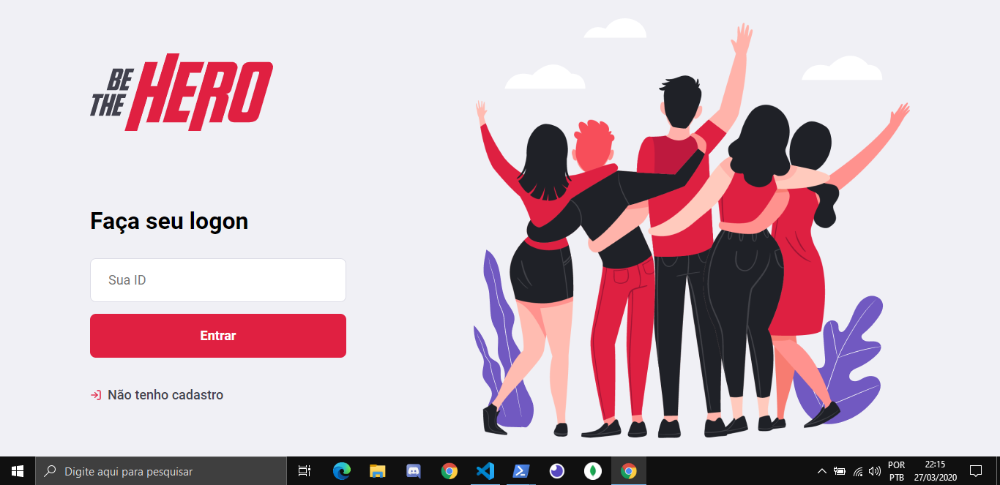
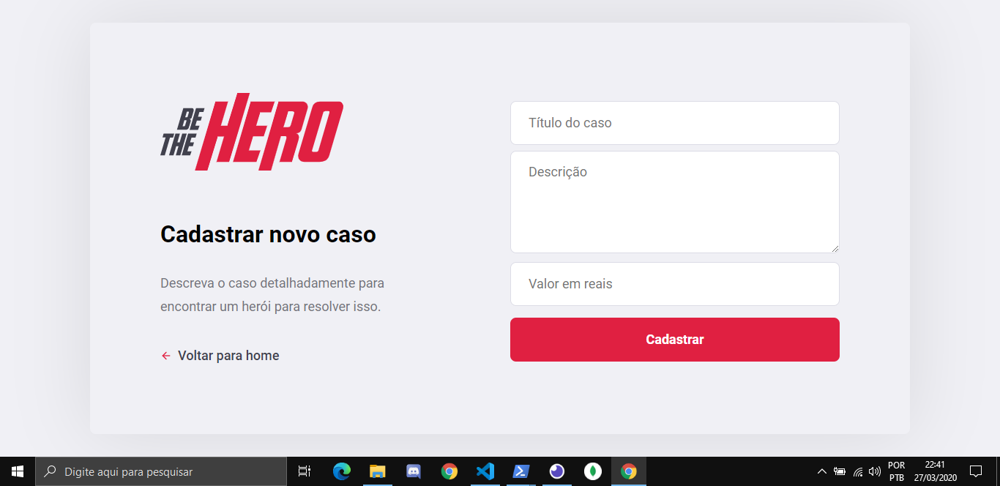
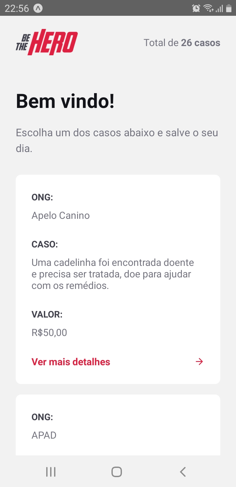

<h3 align="center">


</h3>

<div align="center">
  Projeto realizado durante a Semana OmniStack #11
</div>
<br/>&nbsp;


<p align="center">
  <a href="#books-projeto">Projeto</a>&nbsp;&nbsp;&nbsp;|&nbsp;&nbsp;&nbsp;
  <a href="#telescope-tecnologias">Tecnologias</a>&nbsp;&nbsp;&nbsp;|&nbsp;&nbsp;&nbsp;
  <a href="#camera-imagens">Imagens</a>&nbsp;&nbsp;&nbsp;|&nbsp;&nbsp;&nbsp;
  <a href="#computer-instalando-o-projeto">Instalação</a>
</p>

<br/>


## :books: Projeto

[Be The Hero](https://github.com/HigorDenomar/be-the-hero) é um projeto projeto feito para que ONG's possam publicar seus casos, e assim conseguir doações.

As ONG's podem cadastrar os casos pelo site, informando o preço que precisam e deixando mais informações sobre o caso.

Quem estiver interessado em fazer uma doação, pode entrar pelo aplicativo mobile e visualizar todos os casos cadastrados, tendo a opção de ver os detalhes cada uma, juntamente com o E-mail e Whatsapp da ONG responsável pelo caso.

&nbsp;

## :telescope: Tecnologias

Para o backend da aplicação foi construinda uma API REST com [Node.js](https://nodejs.org).

Para o fontend foi utilizado o [React.js](https://reactjs.org) para a construção do site, e o [React Native](https://reactnative.dev/) para o aplicativo mobile.

&nbsp;

## :camera: Imagens

#### Web:



&nbsp;


&nbsp;



&nbsp;

---

#### Mobile:

 &nbsp; &nbsp; &nbsp; 

&nbsp;

## :computer: Instalando o projeto

Pra instalar o projeto, rode o comando a seguir nas pastas 'backend', 'web' e 'mobile':
```
> npm install
```
<br/>

Depois execute o projeto rodando o comando a seguir nas mesmas pastas citadas anteriormente:

```
> npm start
```
